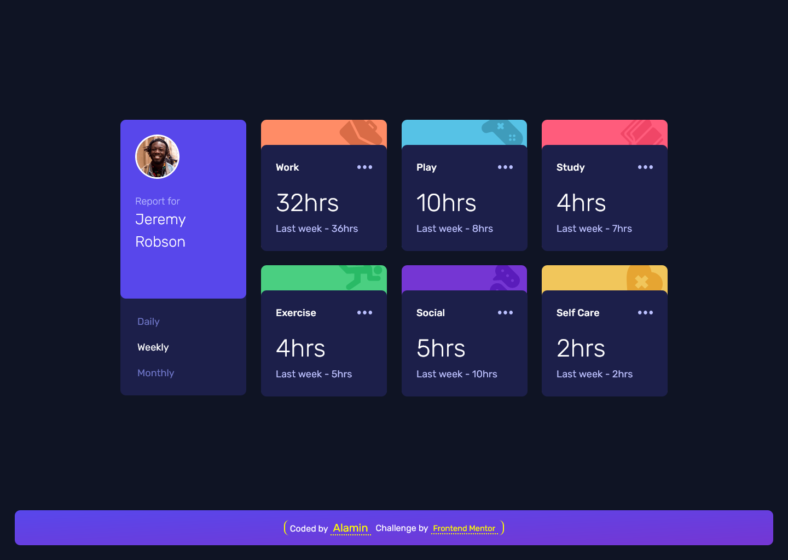

<h1 align="center">Time tracking dashboard</h1>
<div align="center">

Challenge from [Frontend Mentor](https://www.frontendmentor.io/profile/CodePapa360)

</div>

<h2 align="center">

[🚀Live Site](https://time-tracking-dashboard-codepapa360.netlify.app/)
|
[💡Frontend Mentor]()

</h2>

<p align="center">
A practice project from Frontend Mentor, showcasing a dynamic time tracking dashboard. Implementing HTML, SASS, and JavaScript, it offers daily, weekly, and monthly views with current and previous time data.
</p>

<a align="center" href="https://time-tracking-dashboard-codepapa360.netlify.app/">



</a>

## The challenge

Users should be able to:

- View the optimal layout for the site depending on their device's screen size
- See hover states for all interactive elements on the page
- Switch between viewing Daily, Weekly, and Monthly stats
- **Bonus:** Utilized JSON data to dynamically populate and display statistics

## Built with

- JavaScript
- Semantic HTML5 markup
- Mobile-first workflow
- [SASS - a CSS pre-processor](https://sass-lang.com/)
- CSS custom properties
- CSS Grid
- CSS Flexbox
- NPM
- [Webpack - a module bundler](https://webpack.js.org/)

## What I learned

During the development of this time tracking dashboard project, I expanded my existing skills and tackled various challenges to create a polished and functional application. Here are some key takeaways from my experience:

- Responsive Design: I further refined my expertise in crafting responsive layouts that seamlessly adapt to different devices and screen sizes. This involved employing CSS media queries and employing flexible layout techniques with Flex and Grid to ensure a smooth user experience across devices.

- Data Fetching and Handling: I deepened my understanding of data retrieval by utilizing JavaScript's Fetch API to retrieve data from an external JSON source. I also implemented error handling to gracefully manage any potential issues during the data fetching process.

- Dynamic Content Rendering: I successfully implemented dynamic rendering of data onto the dashboard, elevating the user experience. This involved manipulating the DOM to dynamically update specific elements with fetched data in real-time.

- Event Handling and User Interactions: By incorporating event listeners, I enabled seamless interaction with the dashboard. Users can effortlessly switch between daily, weekly, and monthly views, while ensuring the active button state and corresponding data retrieval are managed effectively.

- Code Optimization and Organization: Through refactoring and optimizing my JavaScript code, I enhanced the project's efficiency and maintainability. I focused on eliminating code redundancy, and improving code readability.

Throughout the development process, I encountered challenges such as asynchronous data handling and simultaneous updates of multiple elements.

In summary, this project provided an opportunity for me to further advance my front-end development skills, apply best practices, and create an interactive and visually appealing time tracking dashboard.

## Installation

- Clone this repo:

```sh
git clone https://github.com/CodePapa360/Time-tracking-dashboard.git
```

- Install dependencies:

```sh
npm install
```

- Build command:

```sh
npm run build
```

- Live server:

```sh
npm start
```

## Author

<b>👤 Alamin</b>

- Twitter - [@CodePapa360](https://www.twitter.com/CodePapa360)
- LinkedIn - [@CodePapa360](https://www.linkedin.com/in/codepapa360)
- Frontend Mentor - [@CodePapa360](https://www.frontendmentor.io/profile/CodePapa360)
- Github: [@CodePapa360](https://github.com/codepapa360)

Feel free to contact me with any questions or feedback!

## Show your support

Give a ⭐️ if you liked this project!

## Acknowledgments

Special thanks to Frontend Mentor for providing such an amazing platform to practice and improve my frontend skills. The challenges and projects available on the website were both fun and challenging, and helped me learn a lot in a short amount of time.

## License

This project is licensed under the [MIT](https://github.com/CodePapa360/Time-tracking-dashboard/blob/main/LICENSE.md) license, which means you can use, modify, and distribute the code as you wish. If you have any questions or feedback, feel free to reach out. Thank you for considering my code!
